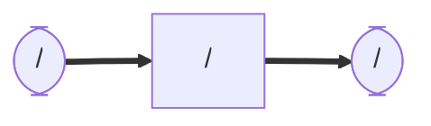

# lucia_vital_pub
### Node and Topic

## Dependency
## Setup
```
$ cd ~/ros2_ws/src  #Go to ros workspace
$ git clone https://github.com/iHaruruki/lucia_vital_pub.git #clone this package
$ cd ~/ros2_ws
$ colcon build --packages-select lucia_vital_pub
$ source install/setup.bash
```
## Usage


## License
## Authors
## References
